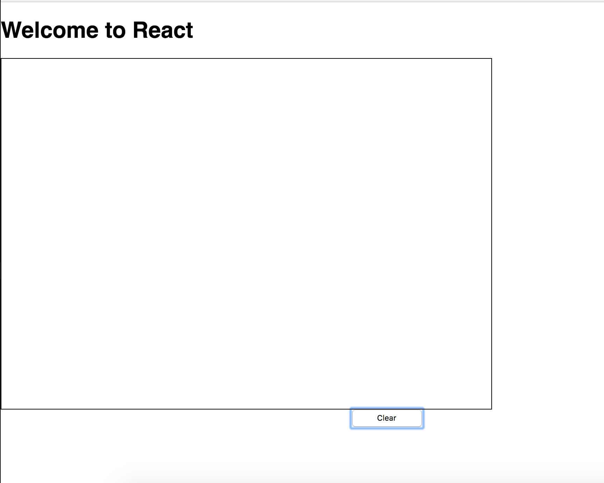

# react-drawing-canvas

Using react, made a simple drawing canvas. Currently you can only draw and clear, but in the future a save option will be available.



## Usage

1. clone the repo

```
  git clone https://github.com/lilylei95/react-drawing-canvas.git
```

2. Install all the dependencies

```
  npm install
```

3. Start the program

```
  npm start
```

4. Draw away! You can clear the canvas by clicking the clear button.
